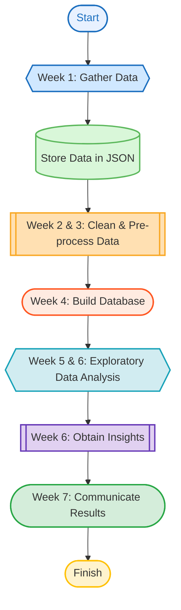

# LSE DS105, Autumn Term 2024, Final Group Project

**Table of Contents**
1. [Research Question ❓](#research-question-)
2. [Team Members 🧑‍🤝‍🧑🧑‍🤝‍🧑](#team-members-)
3. [Step-by-Step Guide: How to Get GDELT API Credentials](#step-by-step-guide-how-to-get-gdelt-api-credentials)
4. [Project Structure](#project-structure)
5. [Our Notebooks](#our-notebooks)
7. [Use of AI](#use-of-ai)
8. [Data Collection](#data-collection)
9. [Making our data frames](#making-our-data-frames)
10. [Project Timeline](#project-timeline)
11. [Sources](#sources)


## Research Question ❓
### To what extent do economic indicators influence public sentiment regarding democracy over time (2014-2024)? 

## Team Members ​​​​​​​​🧑‍🤝‍🧑🧑‍🤝‍🧑
- Nadia | BSc in Politics and Data Science 
- Alice | BSc in Politics and Data Science 
- Maggie | BSc in Politics and Data Science 
- Ismahan | BSc in Politics and Data Science


## Step-by-Step Guide: How to Get GDELT API Credentials

To access the GDELT data via Google Cloud Storage or the Google Cloud API, you need to set up **Google Cloud Storage credentials**. Follow these steps to get your API credentials:

### Step 1: Set up a Google BigQuery Account 
1. Go to the [Google Cloud Console](https://console.cloud.google.com/) and log in with your Google account.
2. Create a Google Cloud Project and enable BigQuery in the project. 
3. Ensure billing is enabled for your project (you can use free-tier credits for small-scale queries). 


### Step 2: Search for the GDELT Events Database
1. Navigate to the BigQuery Console within the Google Cloud Console. 
2. In the Explorer panel search for the GDELT Events dataset:
   - Dataset name: **gdelt-bq.gdeltv2.events**
3. Click on the dataset to explore its structure and available tables. 


### Step 3: Query the Data Using an SQL Command
1. Use the following SQL query to retrieve the GDELT data you need:
```sql
SELECT SQLDATE, EventCode, ActionGeo_CountryCode, AvgTone, GoldsteinScale, NumMentions
FROM `gdelt-bq.gdeltv2.events`
WHERE ActionGeo_CountryCode IN ('US', 'FR', 'IR', 'BR', 'IN', 'ZA')
  AND EventRootCode IN ('10', '11', '13', '14', '15', '18', '20')
  AND SQLDATE BETWEEN 20130101 AND 20231231
ORDER BY SQLDATE DESC;
```
**(Note):** 
- Google cloud storage has storage limits based on your account tier.
- If storage is limited, chunk the data by year or country after step 3 when exporting to GCS.
   
### Step 4: Save the Data to your Personal Google Cloud Storage (GCS)
1. Export the query results to your Google Cloud Storage bucket:
   - In the BigQuery Console, click **Export** -> **Google Cloud Storage**.
   - Specify a GCS bucket where the data should be saved.

### Step 5: Add IAM permission in Google Cloud Storage
1. Go to Cloud storage console in google cloud.
2. Select your GCS bucket.
3. Click permissions -> grant access
4. Add an IAM role to allow table access:
   - Role: BigQuery Data Viewer or Storage Object Viewer
   - Add permisiions for any users or services that need access.
  
### Step 6: Download the Access Key as a JSON
1. In the google cloud console:
   - Navigate to IAM & Admin -> Service Accounts.
   - Select or Create a service account for accessing the GDELT data.
   - Click Keys -> Add Key -> JSON to download the access key.
2. Place downloaded key file in the access_keys folder in our project directory.

### Step 7: Use the Google Cloud Storage Package to Read the Data
1. Use the google.cloud.storage package to access the GCS bucket and your access keys to read the data from google cloud storage. 
---

**How to run the code:**
* It is important to note that the V-Dem dataset CSV file (`V-Dem-CY-Full_Others-v14.csv`) is too large to be pushed onto GitHub. Download the CSV file from [google drive](https://drive.google.com/file/d/1sNnXEPfPSP6ksAgmuW-d3xZ7MSC1BPpM/view?usp=sharing), place the file in `data/processed/`, and add `data/processed/V-Dem-CY-Full_Others-v14.csv` to the `.gitignore` file.
1. Install the necessary packages from the `requirements.txt` file: pip install -r `requirements.txt`
2. Run each notebook in order: NB01 -> NB02 -> NB03
    * NB01 will collect the data from the APIs (GDELT and WorldBank) and deposit them into JSON files, while V-Dem will be downloaded as a CSV file 
    * NB02 will produce clean datasets from the JSON files and CSV file. It will deposiy this data into a database 
    * NB03 will visualise the data, displayed directly on the notebook

## Project Structure

```
PROJECT POLDA/
│
├── code/
│   ├── NB01: Data Collection
│   ├── NB02: Data Processing
│   ├── NB03: Data Visualization
│   ├── functions.py
│   └── visuals.py
│
├── data/
│   ├── raw/
│   └── processed/
│
├── docs/
│   ├── index.md
│   └── images/
│
├── reflections/
│   ├── alice.md
│   ├── ismahan.md
│   ├── nadiabegic.md
│   └── alice.md
│
├── .gitignore
├── README.md
└── requirements.txt
```

## Our Notebooks 
Our project is organized into three key notebooks, each focusing on a specific stage of the workflow: **data collection**, **data processing**, and **visualization**.

- **1️⃣ NB01: Data Collection**  
  - **Purpose:** Collect raw data from the **World Bank API**, **GDELT API**, and other sources for analysis.

- **2️⃣ NB02: Data Processing**  
  - **Purpose:** Clean and process data collected in NB01, filter the large **V-Dem dataset**, and export the processed data into an **SQLite database**.

- **3️⃣ NB03: Data Visualization**  
  - **Purpose:** Create visualizations to analyze the relationship between **economic conditions**, **journalistic tone**, and **democratic actions**.  
  - **Features:** Includes bar charts and a geopandas map to provide actionable insights into our research question.


## Work Distribution Strategy 🗂️

| Contributor        | Data Collections (%) | Data Cleaning (%) | Visualisations (%) | Repository Organisation (%) | Documentation (%) |
|--------------------|-----------------------|-------------------|---------------------|----------------------------|--------------------|
| Maggie         | 50                   | 50                | 60                  | 25                         | 25                 |
| Alice           | -                   | 15                | -                  | 25                         | 25                 |
| Ismahan     | 25                  | 35               | -                 | 25                         | 25                 |
| Nadia     | 25                  | -               | 40                 | 25                         | 25                 |

## Use of AI
AI tools (e.g. ChatGPT) supported this project through debugging, interpreting API documentation, and streamlining access to cloud datasets. All analysis and code were written independently.

## Data Collection 

### Collection of GDELT Data

We collected key event and news data from the **GDELT (Global Database of Events, Language, and Tone)** using the GDELT API. GDELT provides real-time monitoring of global events, providing insights into political, social, and economic phenomena from news reports across the world.

#### Countries Included:
We focused on the following countries for the data collection:
- **USA** (United States of America)
- **BRA** (Brazil)
- **FRA** (France)
- **ZAF** (South Africa)
- **IRN** (Iran)
- **IND** (India)

We selected countries we thought had experienced changes in economic status, political order, or rises in populism. We selected one country from each major area of the world to get geographic diversity in our data. 

#### Key Data Collected:
The data collected includes key event and news data from the GDELT database, which encompasses various dimensions such as:
- **Event Data**: Information on political, social, and economic events occuring in each country. 
- **Tone Data**: Sentiment analysis and tone scores of news reports related to the events.
- **Geographical Data**: Data points related to country-specific events, including event occurrences and mentions.

#### Time Frame:
- **Start Year**: 2014
- **End Year**: 2023

#### How the Data Was Collected:
The data was collected using a custom Python function that interacts with the **Google Cloud Storage** and **GDELT** data bucket. The process involves querying the data for each of the countries listed and retrieving the relevant event data and tone scores for the specified time period (2014-2023). The data collection process is managed by the following Python code:

```
python
os.environ["GOOGLE_APPLICATION_CREDENTIALS"] = "/Users/maggiemyslik/ds105a-2024-project-polda/access_keys/python-access.json"
client = storage.Client()
bucket_name = "gdelt_data_yearly_storage"  
bucket = client.bucket(bucket_name)
countries = ['US', 'FR', 'ZA', 'IR', 'BR', 'IN']
output_dir="../data/raw/gdelt/"
functions.process_gdelt_data(bucket, countries, output_dir)
```

### Collection of World Bank Data

We collected key economic and social indicators from the **World Bank API** using the [World Bank Open Data API](https://data.worldbank.org/developers). The API provides access to a wide range of data on various aspects of global development.

#### Key Indicators Collected:
1. **GDP Growth (annual %)** - Indicator: `NY.GDP.MKTP.KD.ZG`
2. **Inflation (consumer prices, annual %)** - Indicator: `FP.CPI.TOTL`
3. **Unemployment (% of total labor force)** - Indicator: `SL.UEM.TOTL.ZS`
4. **Income Share Held by the Lowest 20%** - Indicator: `SI.DST.FRST.20`
5. **GINI Index (World Bank estimate)** - Indicator: `SI.POV.GINI`
6. **Poverty Headcount Ratio at $2.15 a Day (2017 PPP)** - Indicator: `SI.POV.DDAY`
7. **Education Expenditure (% of GDP)** - Indicator: `SE.XPD.TOTL.GD.ZS`
8. **Government Effectiveness (Estimate)** - Indicator: `GE.EST`
9. **Control of Corruption (Estimate)** - Indicator: `CC.EST`

#### Time Frame:
- **Start Year**: 2014
- **End Year**: 2023

#### How the Data Was Collected:
The data was collected using a custom Python function, `collect_data`, that interacts with the **World Bank API**. This function queries the API for the indicators listed above and retrieves data for the countries within the specified time range (2014-2023).

The World Bank API allows us to query data by country, indicator, and time period. We used the appropriate API endpoints to fetch data for each country and indicator and saved the results in a **raw data folder** for further analysis.

#### Data Location:
- The collected data is saved in the directory: `data/raw/world_bank`

This collection of data will allow us to analyze key economic, social, and governance indicators to understand how these factors influence global development and stability across the selected countries from 2014 to 2023.

## Making our data frames 

**World Bank DataFrame** 

| country_id | country_name  | iso3code | indicator_id       | indicator_name                                            | year | value   |
|------------|---------------|----------|--------------------|-----------------------------------------------------------|------|---------|
| ZA         | South Africa  | ZAF      | SL.UEM.TOTL.ZS     | Unemployment, total (% of total labor force)              | 2023 | 27.988  |
| ZA         | South Africa  | ZAF      | SL.UEM.TOTL.ZS     | Unemployment, total (% of total labor force)              | 2022 | 28.838  |
| ZA         | South Africa  | ZAF      | SL.UEM.TOTL.ZS     | Unemployment, total (% of total labor force)              | 2021 | 28.770  |
| ZA         | South Africa  | ZAF      | SL.UEM.TOTL.ZS     | Unemployment, total (% of total labor force)              | 2020 | 24.339  |
| ZA         | South Africa  | ZAF      | SL.UEM.TOTL.ZS     | Unemployment, total (% of total labor force)              | 2019 | 25.538  |
| ZA         | South Africa  | ZAF      | SL.UEM.TOTL.ZS     | Unemployment, total (% of total labor force)              | 2018 | 24.218  |
| ZA         | South Africa  | ZAF      | SL.UEM.TOTL.ZS     | Unemployment, total (% of total labor force)              | 2017 | 23.992  |
| ZA         | South Africa  | ZAF      | SL.UEM.TOTL.ZS     | Unemployment, total (% of total labor force)              | 2016 | 24.023  |
| ZA         | South Africa  | ZAF      | SL.UEM.TOTL.ZS     | Unemployment, total (% of total labor force)              | 2015 | 22.869  |
| ZA         | South Africa  | ZAF      | SL.UEM.TOTL.ZS     | Unemployment, total (% of total labor force)              | 2014 | 22.606  |

### Summary of Changes:
- **Converted the `year` column to nullable integer (`Int64`)**: We used `pd.to_numeric()` to convert the `year` column to numeric values, and non-numeric values were coerced to `NaN`. Then, we cast it to the `Int64` dtype to preserve missing values as `NaN`.
  
- **Converted the `value` column to float**: We ensured that the `value` column is treated as a float, again using `pd.to_numeric()` with `errors='coerce'` to handle any invalid values by converting them to `NaN`.

- **Replaced `NaN` values with `None`**: We replaced all `NaN` values in the DataFrame with `None` using `worldbank_df.where(pd.notnull(worldbank_df), None)`.

- **Dropped duplicate rows**: We removed any duplicate rows from the DataFrame using `drop_duplicates(inplace=True)`.

- **Dropped the `unit` column**: We removed the `unit` column from the DataFrame using `drop(columns=['unit'], inplace=True)`.

These changes ensure that our data is cleaned, with the `year` and `value` columns correctly typed, and missing values replaced by `None`.

**V-Dem DataFrame**

| country_name  | country_text_id | year | v2x_polyarchy | v2peapsecon | v2pepwrses | v2mecrit | v2cacamps |
|---------------|-----------------|------|---------------|-------------|------------|----------|-----------|
| South Africa  | ZA              | 2014 | 0.749         | -0.600      | 1.356      | 2.159    | 0.204     |
| South Africa  | ZA              | 2015 | 0.749         | -0.600      | 1.280      | 2.159    | 0.204     |
| South Africa  | ZA              | 2016 | 0.746         | -0.600      | 1.407      | 2.159    | 0.204     |
| South Africa  | ZA              | 2017 | 0.736         | -0.600      | 1.407      | 2.198    | 0.204     |
| South Africa  | ZA              | 2018 | 0.736         | -0.600      | 1.324      | 2.198    | 0.204     |
| South Africa  | ZA              | 2019 | 0.711         | -0.600      | 1.487      | 2.522    | 0.204     |
| South Africa  | ZA              | 2020 | 0.714         | -0.600      | 1.165      | 2.522    | 0.411     |
| South Africa  | ZA              | 2021 | 0.724         | -0.600      | 1.356      | 2.522    | 0.411     |
| South Africa  | ZA              | 2022 | 0.711         | -0.211      | 1.356      | 1.752    | 0.411     |
| South Africa  | ZA              | 2023 | 0.687         | -0.211      | 1.294      | 1.752    | 0.348     |

### Summary of Operations:

1. **Defined Interesting Columns**:  
   We created a list of columns to focus on in the analysis:
   - `'country_name'`, `'country_text_id'`, `'year'`, `'v2x_polyarchy'`, `'v2peapsecon'`, `'v2pepwrses'`, `'v2mecrit'`, `'v2cacamps'`.

2. **Defined Required Countries**:  
   We specified a list of countries to include in the analysis:
   - `'United States of America'`, `'Brazil'`, `'India'`, `'Iran'`, `'France'`, `'South Africa'`.

3. **Filtered the DataFrame**:  
   We filtered the `vdem_df` DataFrame to include only:
   - Data from **2014 to 2023** (inclusive).
   - Data for the specified **required countries**.

4. **Selected Interesting Columns**:  
   After filtering the DataFrame, we selected only the relevant columns from the `interesting_columns` list.

5. **Modified `country_text_id`**:  
   We altered the `'country_text_id'` column by keeping only the **first two characters** of the country code using the `.str[:2]` method.

---

As a result, we obtained a filtered DataFrame (`vdem_filtered_df`) with data for specific countries and years, containing the columns of interest, and with the `country_text_id` column modified to show just the first two characters of the country code.

**G-Delt dataframe**

| country_code | year | EventCode | num_occurrences | num_mentions | avg_goldstein | min_goldstein | max_goldstein | avg_tone   | min_tone   | max_tone   |
|--------------|------|-----------|-----------------|--------------|---------------|---------------|---------------|------------|------------|------------|
| BR           | 2014 | 100       | 53              | 456          | -5.0          | -5.0          | -5.0          | -1.926542  | -8.457711  | 2.334630   |
| BR           | 2014 | 110       | 85              | 612          | -2.0          | -2.0          | -2.0          | -2.046491  | -6.090808  | 4.776119   |
| BR           | 2014 | 111       | 73              | 507          | -2.0          | -2.0          | -2.0          | -1.141896  | -7.122507  | 8.181818   |
| BR           | 2014 | 112       | 147             | 838          | -2.0          | -2.0          | -2.0          | -5.206381  | -12.637363 | 2.007648   |
| BR           | 2014 | 113       | 8               | 81           | -2.0          | -2.0          | -2.0          | -2.002371  | -5.091938  | 0.696864   |
| BR           | 2014 | 114       | 30              | 247          | -2.0          | -2.0          | -2.0          | -1.425442  | -5.097087  | 1.722724   |
| BR           | 2014 | 130       | 47              | 291          | -4.4          | -4.4          | -4.4          | -2.836998  | -8.910891  | 3.249097   |
| BR           | 2014 | 132       | 6               | 30           | -5.8          | -5.8          | -5.8          | -2.399608  | -2.694611  | -1.919721  |
| BR           | 2014 | 138       | 14              | 59           | -7.0          | -7.0          | -7.0          | -0.784934  | -8.110687  | 5.988024   |
| BR           | 2014 | 140       | 1               | 8            | -6.5          | -6.5          | -6.5          | -5.223881  | -5.223881  | -5.223

## Project Timeline



## Sources

| **Source**             | **Description**                                                                                                                                                           | **Limitations**                                                      | **Solution**                                               |
|------------------------|---------------------------------------------------------------------------------------------------------------------------------------------------------------------------|----------------------------------------------------------------------|------------------------------------------------------------|
| **[GDELT API](https://www.gdeltproject.org/)**   | - Global journalism database, updated every 15 minutes. <br> - Collects from a vast range of global news media sources, including broadcast, print, and web formats, from nearly every country in over 100 languages. <br> - Uses language processing to capture the mood, themes, and sentiment of each article. | - Only using journalism as an indicator of satisfaction, not a direct measure. | - Limit findings to directly address media perspectives, don't generalize to the country as a whole. |
| **[V-Dem Data Set](https://www.v-dem.net/)**    | - A wealth of comprehensive data. <br> - Level of democracy, implementation of democracy, the relationship between the government and media. <br> - Credibility, over 3,500 experts. <br> - CSV file. | - No direct answer making inferences. <br> - Limited accuracy of the data in less transparent countries. | - Addition of GDELT API data.                            |
| **[World Bank API](https://documents.worldbank.org/en/publication/documents-reports/api)**  | - Highly reliable as data comes from a globally trusted institution. <br> - Provides key economic indicators like unemployment, GDP growth, and inflation. <br> - Offers consistent data for most countries enabling cross-country comparisons and trend analysis. | - Data quality may vary across countries with less developed statistical systems, leading to potential inaccuracies. | - Cross-reference data with secondary data sets such as IMF, etc. |


